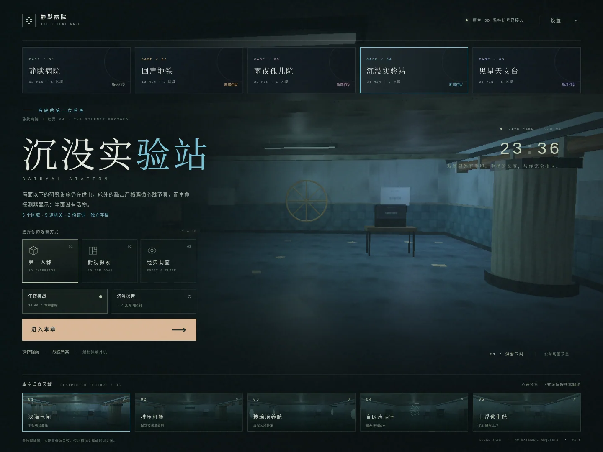

# 静默病院：禁区重构

**THE SILENT WARD — RECONSTRUCTED EDITION / v2.0.0**



23:48。废弃病院的电话再次响起。在午夜之前恢复供电、破解门禁，带走那些被抹去的姓名。

这是一个可直接部署到 **GitHub Pages** 的完整 HTML5 恐怖解谜游戏。没有打包依赖、CDN、登录、广告、数据上报或后端。游戏本身只需要静态文件。**不是只展示截图的交互原型**：三维视角可以行走、转向、碰撞和近距离调查，二维视角可以自动寻路，经典调查视角保留原版谜题和 SVG 场景。

## 立即运行

下载并解压后，在包含 `index.html` 的目录打开终端：

```bash
python -m http.server 8000
```

浏览器打开 `http://localhost:8000`。运行游戏不需要安装 npm 包。

也可以直接打开 `dist/silent-ward-v2-standalone.html`。这是含所有脚本、样式、菜单缩略图的离线单文件版本。浏览器对 `file://` 存储的行为可能不同，正式游玩及部署推荐 HTTP / HTTPS。

## 三种视角

| 视角 | 玩法 | 实现 |
| --- | --- | --- |
| 3D 第一人称 | 自由行走、环顾、走近线索调查；迷你地图辅助定位 | 原生 WebGL 2，自研轻量渲染器 |
| 2D 俯视探索 | 点击空地寻路；点击线索自动接近；支持键盘和摇杆 | 独立 Canvas 2D 绘制，A* 寻路 |
| 经典调查 | 原版固定 SVG 场景，点击标记阅读、输入和操作机关 | HTML / CSS / SVG |

三种视角共享同一份线索、背包、证词、机关、计时与存档。游戏中用顶部按钮或 `1 / 2 / 3` 切换，不会重开游戏。场景切换通过底部地点栏；病房与档案室先取得对应钥匙才能进入。场景并非同一张地图的五种滤镜。

画面截图：[3D 第一人称](docs/screenshots/3d.webp) · [2D 俯视](docs/screenshots/2d.webp) · [经典调查](docs/screenshots/investigation.webp) · [手机俯视布局](docs/screenshots/mobile-2d.webp)

## 五个独立场景

| 区域 | 空间与氛围 | 解谜主题 |
| --- | --- | --- |
| 01 护士站 | 青绿色瓷砖、L 形值班台、旧电话、交班牌与挂历 | 日期密码 |
| 02 07 号病房 | 冷蓝雨窗、病床、输液架、帘子与裂镜 | 图案与数字转换 |
| 03 封存档案室 | 旧纸与暖黄灯、成排书架、封存柜与旧合影 | 时间顺序归档 |
| 04 地下配电室 | 锈色管道、发电设备、开关柜与应急红灯 | 熔断器安装、旋转电路 |
| 05 离院长廊 | 深长走道、门牌、轮椅、绿灯与最后一道门 | 离院凭证与门禁 |

环境使用程序化污渍、裂纹、瓷砖、金属与织物材质。三维包含手电光锥、点光源、阴影贴图、距离雾、微尘、暗角、胶片颗粒及辉光。动态人影、低沉回声和脚步采用克制的无快速频闪设计。

**内容提示：** 压抑环境、恐怖暗示、短暂人影及意外音效。设置中可分别关闭声音、人影惊吓、镜头运动与胶片效果。先用较低设备音量试听。

## 模式与结局

- **午夜挑战：** 12 分钟；错误提交扣 10 秒，每次展开新提示扣 20 秒。普通线索弹窗仍会计时，暂停、设置以及页面隐藏暂停计时。
- **沉浸探索：** 无倒计时，可慢慢阅读与尝试。保留同样的机关和逃生结局。
- **三种结局：** 完整证词逃生、普通逃生、午夜超时。完整答案放在独立的 [剧透攻略](docs/WALKTHROUGH.md)，不要提前打开。

## 操作

| 操作 | 电脑 | 手机 |
| --- | --- | --- |
| 移动 | WASD；Shift 加快；方向键也可使用 | 左下摇杆 |
| 3D 环顾 | 按住拖动，或点击场景锁定鼠标 | 拖动空白场景 |
| 调查 | 靠近标记后按 E 或点击标记 | 靠近后点“调查”或标记 |
| 2D 寻路 | 点击空地；点击线索自动接近 | 点击空地或线索 |
| 切换视角 | 1 / 2 / 3 或顶部按钮 | 顶部按钮 |
| 线索 / 物品 / 提示 | J / B / H | 底部工具栏 |
| 手电 / 静音 / 暂停 | F / M / Esc | 对应界面按钮 |

设置里的“重置当前位置”只把玩家送回本场景入口，不清空解谜进度。手机横屏能展示更多空间，竖屏也有独立布局。全屏和鼠标锁定属于可选增强，浏览器拒绝时仍可正常游玩。

## 部署到 GitHub Pages（推荐：随包工作流）

1. 创建一个 GitHub 仓库，建议使用公开仓库和 `main` 分支。将**本目录中的内容**放到仓库根目录；`index.html` 必须在根目录，不要多套一层文件夹。用 Git 推送会一并包含隐藏的 `.github`、`.nojekyll` 文件。
2. 进入仓库 **Settings → Pages → Build and deployment → Source → GitHub Actions**。
3. 打开 **Actions → Deploy Silent Ward to GitHub Pages → Run workflow**。以后向 `main` 推送会自动触发。部署成功后的地址可在 Pages 设置页或本次工作流中查看。

第一次上传时尚未开启 Pages，工作流可能先失败；设置好 Source 后重新运行即可。仓库策略、权限或组织的 Pages 限制需要仓库管理员处理。

工作流只发布 `index.html`、`assets/`、`src/`、`styles/` 和 `.nojekyll`。攻略、测试和离线生成器不会被它发布到游戏站点。所有资源均使用相对路径，适配普通项目站点的仓库子路径。

### 不使用 Actions 工作流的替代方式

删除或禁用 `.github/workflows/deploy.yml` 后，在 **Settings → Pages** 选择 **Deploy from a branch → main → /(root) → Save**。此方式会发布根目录下其他公开文件，包括 `docs/` 中的攻略；游戏本身不会链接到攻略。

官方说明与工作流来源，核对日期 2026-10-07：

- https://docs.github.com/en/pages/getting-started-with-github-pages/configuring-a-publishing-source-for-your-github-pages-site
- https://github.com/actions/starter-workflows/blob/main/pages/static.yml

这份源码包并不包含已经创建的仓库或已经上线的个人站点；需要在你自己的 GitHub 账户完成以上发布步骤。

## 源码结构

```text
index.html                  页面结构和所有游戏入口
styles/legacy.css           原版调查界面、谜题、弹窗和结局样式
styles/cinema.css           新菜单、沉浸 HUD、响应式与舒适设置样式
src/puzzles.js              原版谜题、线索、物品、计时、存档、结局
src/engine.js               WebGL 2 渲染器、几何、纹理、光影与后处理
src/worlds.js               五套独立场景、碰撞体、交互点与平面道具
src/topdown.js              2D 平面绘制、玩家、路线与迷你地图
src/app.js                  三视角切换、输入、寻路、音效与系统整合
assets/                    本地图标和真实渲染的菜单预览图
dist/                      可直接打开的离线单文件游戏
docs/TECHNICAL.md            架构、扩展方式和技术边界
docs/TEST_REPORT.md          测试方法、结果与尚未验证的平台
docs/WALKTHROUGH.md          独立完整剧透攻略
tests/                      可复现的 Playwright 测试
tools/build_standalone.py    不依赖第三方包的单文件生成器
.github/workflows/deploy.yml GitHub Pages 发布工作流
LICENSE                     MIT 授权
```

修改源码后，部署目录版不需要额外构建。重新生成离线文件：

```bash
python tools/build_standalone.py
```

## 浏览器、性能与存档

3D 必须能创建 WebGL 2 上下文；不能创建时，自动改用 2D，经典调查也始终保留。默认均衡画质，旧设备建议性能优先或 2D。没有第三方渲染框架和远程模型，代价是风格化、低多边形表现，而非照片级资产或大型商业引擎效果。

进度保存于浏览器 localStorage。清理站点数据、换浏览器、换域名或使用限制存储的隐私环境，可能无法恢复存档。存储不可用时会给出提示，仍能继续当前局；本作没有云存档。沿用原游戏的 v1 存档键，但原离线文件与新的 HTTPS 域名不是同一个存储来源，不会自动跨站迁移。

测试范围与限制请看 [测试记录](docs/TEST_REPORT.md)。本包没有声称已经经过 iOS / Android 真机或线上 GitHub Pages 验证。

## 授权与素材

项目代码、程序化场景、SVG、合成音效和附带场景缩略图随 MIT 许可证提供。没有附带任何系统字体文件、外部商业模型、录音素材、品牌素材或第三方运行库。页面使用设备已有的中文系统字体，不同设备字形可能不同。开发测试工具 Playwright 仅用于测试，不随游戏运行。
